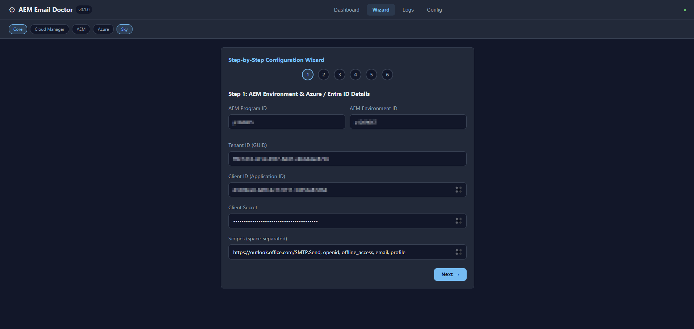
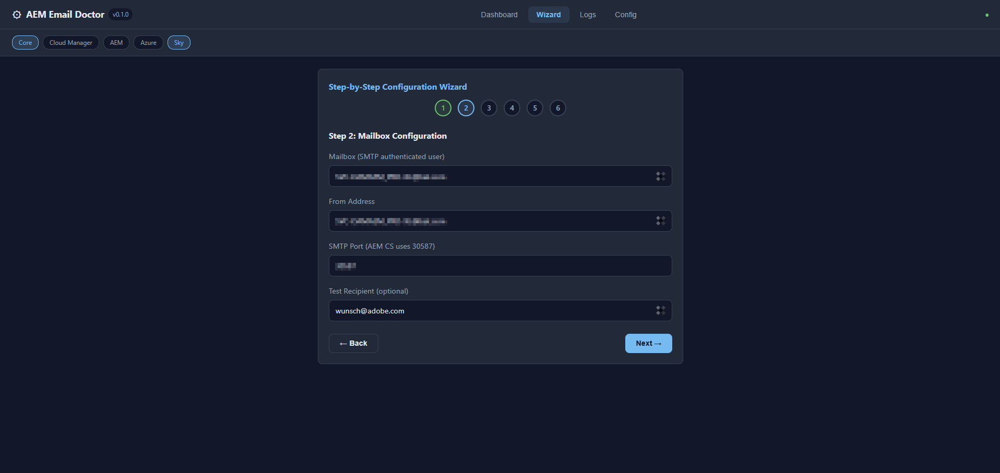
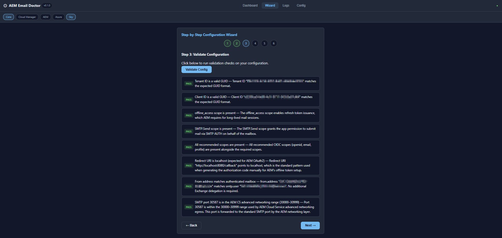
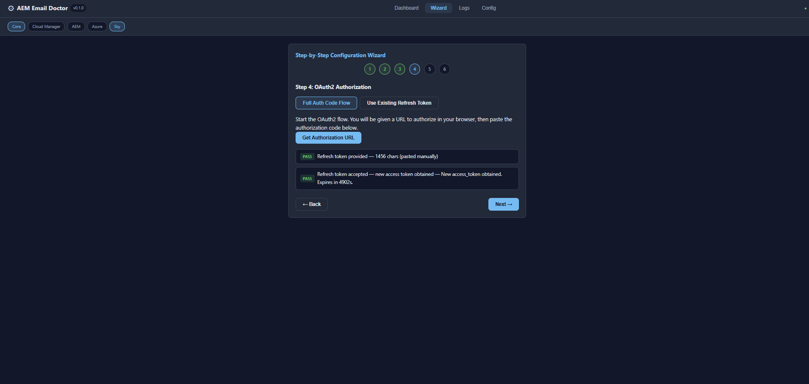
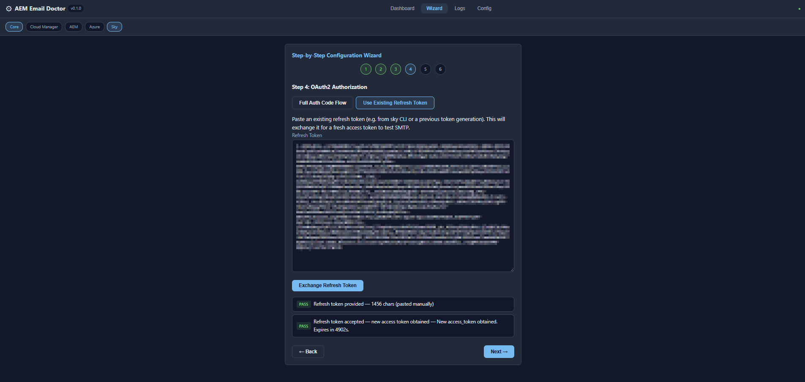
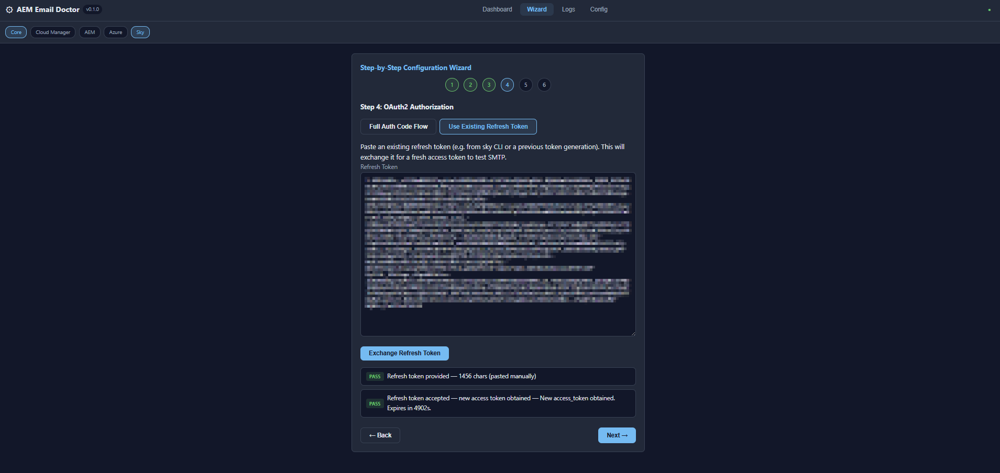
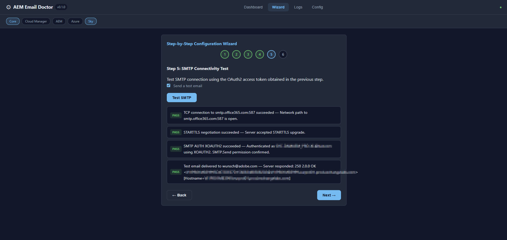
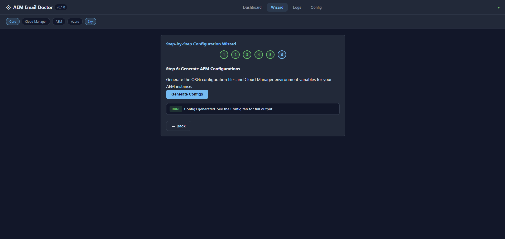
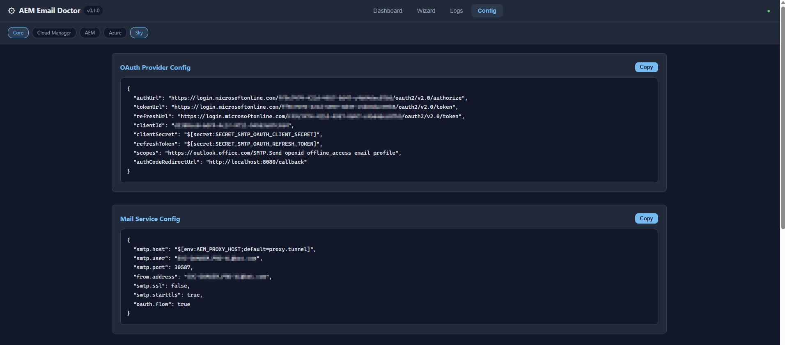
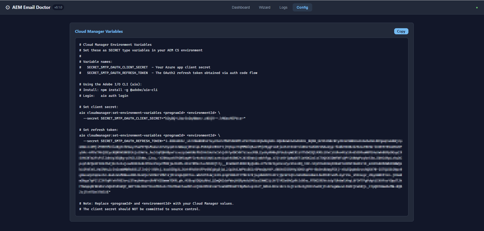

# AEM Email Doctor

A community-built diagnostic tool for email configuration on AEM as a Cloud Service with Microsoft 365 OAuth2 (XOAUTH2).

Sending SMTP mail from AEM as a Cloud Service through Microsoft 365 requires lining up several moving parts: OAuth2 authorization code flow, SMTP AUTH with XOAUTH2, AEM advanced networking, OSGi configurations, and Cloud Manager environment variables. When something goes wrong, the errors are usually opaque and span multiple systems (Entra ID, Exchange Online, AEM OSGi, Cloud Manager).

This tool automates the diagnosis by validating the configuration, testing the OAuth2 token exchange, and performing a live SMTP handshake with `smtp.office365.com` — all from a single place with clear, actionable findings.

> This is an independent open-source project. It is not affiliated with, endorsed by, or supported by Adobe or Microsoft.

## What It Does

1. **Config Validation** — Checks tenant ID, client ID, scopes, redirect URI, SMTP port, and from/user address alignment against the documented AEM and Microsoft requirements
2. **OAuth2 Token Exchange** — Performs the full authorization code flow or refreshes an existing token, reporting each step's success or failure with error-code-specific guidance
3. **SMTP Connectivity Test** — Connects to `smtp.office365.com:587`, negotiates STARTTLS, upgrades to TLS, and authenticates with XOAUTH2, producing a full transcript
4. **Test Email Delivery** — Optionally sends a test email to verify end-to-end delivery
5. **Config Generation** — Generates the correct OSGi JSON configs (`OAuthConfigurationProviderImpl`, `DefaultMailService`) and Cloud Manager variable commands
6. **Knowledge Base** — Built-in explanations for common Microsoft Entra error codes (AADSTS70008, AADSTS700082, 535 5.7.3, etc.) and Send As / Send on Behalf permission guidance

## Architecture

```
src/
  cli/           CLI commands (scan, setup wizard, serve)
  core/          Business logic (no I/O dependencies)
    types.ts         Shared types (Finding, EmailConfig, Severity, CheckStep)
    config-validator.ts  8 validation checks
    oauth.ts         OAuth2 URL/token builders, XOAUTH2 token encoding
    smtp.ts          Raw TCP/TLS SMTP client with STARTTLS + XOAUTH2
    checklist.ts     Report builder
    config-generator.ts  OSGi config and CM variable generator
    knowledge-base.ts    Error codes, doc URLs, Send As guidance
  web/           Express web UI
    server.ts        REST API + WebSocket broadcast
    public/          Single-page dashboard (vanilla JS, no build step)
  providers/     Optional tier integrations (Cloud Manager via aio CLI, Azure via az CLI)
tests/           Vitest unit tests (189 tests)
```

### Diagnostic Findings

Every check produces a `Finding` with:

- **Severity**: PASS, WARN, FAIL, or SKIP
- **Title & Detail**: What happened and why
- **Fix**: Specific remediation steps
- **Doc URLs**: Links to the official AEM and Microsoft documentation pages

## Quick Start

### Prerequisites

- Node.js 18+
- An Entra (Azure AD) app registration with:
  - **API permissions**: `SMTP.Send`, `offline_access`, `openid`, `email`, `profile`
  - **A client secret**
  - **Redirect URI**: `http://localhost:8080` (or your chosen port)
- SMTP AUTH enabled for the mailbox in Exchange Online admin

### Install and Run

```bash
# Clone and start (one command)
git clone https://github.com/rwunsch/aem-email-doctor.git
cd aem-email-doctor
./install-run.sh
# Opens http://localhost:5000
```

On Windows PowerShell:

```powershell
.\install-run.ps1
```

The install script checks Node.js version, installs dependencies, builds, and starts the web UI. Set a custom port with `PORT=8080 ./install-run.sh`.

Or manually:

```bash
npm install
npm run build
npm run serve
```

### Docker

```bash
docker compose up --build
# Open http://localhost:5000
```

### CLI Usage

```bash
# Full diagnostic scan (opens browser for OAuth2)
npx aem-email-doctor scan \
  --tenant-id aaaabbbb-cccc-dddd-eeee-ffffffffffff \
  --client-id 11111111-2222-3333-4444-555555555555 \
  --client-secret "your-secret" \
  --mailbox service-account@company.com \
  --from noreply@company.com \
  --smtp-port 30587

# Interactive setup wizard
npx aem-email-doctor setup

# Web UI on custom port
npx aem-email-doctor serve --port 8080
```

## Web UI Wizard

The web UI provides a 6-step wizard:

### Step 1: Azure / Entra ID Details

Enter your Entra (Azure AD) tenant ID, client ID, client secret, and OAuth2 scopes. Sensitive fields (client secret, authorization code, refresh token) are obfuscated by default — click the eye icon to toggle visibility. This is useful in shared debugging sessions where not all participants should see credentials.



### Step 2: Mailbox Configuration

Configure the SMTP authenticated user (mailbox), from address, port, and optional test recipient.



### Step 3: Validate Configuration

Run all 8 config validation checks — GUIDs, scopes, redirect URI, port range, and from/user alignment.



### Step 4: OAuth2 Authorization

Choose between the full authorization code flow or paste an existing refresh token to exchange for an access token.





### Step 5: SMTP Connectivity Test

Live SMTP handshake: TCP connect, STARTTLS, TLS upgrade, AUTH XOAUTH2, and optional test email delivery.



### Step 6: Generate AEM Configurations

Output ready-to-use OSGi JSON configs and Cloud Manager variable commands.



### Config Tab

The Config tab shows generated OSGi configurations (OAuth Provider + Mail Service) and Cloud Manager variable commands, ready to copy.




The **Dashboard** tab shows all findings with severity counts. The **Logs** tab shows the full SMTP transcript.

## How AEM CS Email with OAuth2 Works

AEM as a Cloud Service does not support basic SMTP authentication. Instead, it uses the **OAuth2 authorization code grant** flow with Microsoft 365:

1. An Entra (Azure AD) app registration is created with `SMTP.Send` delegated permission
2. An admin authorizes the app, producing an **authorization code**
3. The code is exchanged for an **access token** and **refresh token**
4. The refresh token is stored as a Cloud Manager secret (`SECRET_SMTP_OAUTH_REFRESH_TOKEN`)
5. AEM's `DefaultMailService` uses the refresh token to obtain fresh access tokens
6. SMTP connections use **XOAUTH2** authentication: `AUTH XOAUTH2 base64(user=<mailbox>\x01auth=Bearer <token>\x01\x01)`
7. All SMTP traffic goes through AEM's **advanced networking** egress on port 30587

### Common Failure Points

| Problem                   | Symptom                                                                    | This Tool Checks                                            |
| ------------------------- | -------------------------------------------------------------------------- | ----------------------------------------------------------- |
| Wrong scopes              | No refresh token returned                                                  | Config validation (SCOPE_OFFLINE_ACCESS, SCOPE_SMTP_SEND)   |
| Expired refresh token     | AADSTS70008 or AADSTS700082                                                | OAuth2 token exchange with error code lookup                |
| SMTP AUTH disabled        | 535 5.7.3 or 535 5.7.139                                                   | SMTP test with knowledge base match                         |
| Wrong port (587 vs 30587) | Connection timeout from AEM                                                | Config validation (SMTP_PORT_RANGE)                         |
| From/User mismatch        | 550 5.7.60 "SMTP; Client does not have permissions to send as this sender" | Config validation (FROM_MATCHES_USER) with Send As guidance |
| Wrong tenant/client ID    | AADSTS700016                                                               | Config validation (GUID format) + OAuth2 exchange           |

## SMTP Test Details

The SMTP test performs a real connection to `smtp.office365.com:587`:

```
[TCP]  Connect to smtp.office365.com:587
S: 220 AM0PR04CA0001.outlook.office365.com Microsoft ESMTP MAIL Service
C: EHLO aem-email-doctor
S: 250-AM0PR04CA0001.outlook.office365.com [...capabilities...]
C: STARTTLS
S: 220 2.0.0 SMTP server ready
[TLS] Upgraded to TLS (ECDHE-RSA-AES256-GCM-SHA384)
C: EHLO aem-email-doctor (post-TLS)
S: 250-AM0PR04CA0001.outlook.office365.com [...capabilities...]
C: AUTH XOAUTH2 <token>
S: 235 2.7.0 Authentication successful
C: MAIL FROM:<noreply@company.com>
S: 250 2.1.0 Sender OK
C: RCPT TO:<test@example.com>
S: 250 2.1.5 Recipient OK
C: DATA / [email body]
S: 250 2.0.0 OK
C: QUIT
```

Each phase produces a finding (PASS/FAIL) with specific error guidance when something goes wrong.

## Configuration Generation

After a successful test, the tool generates ready-to-use configurations:

**OAuthConfigurationProviderImpl OSGi config** — The OAuth2 provider with correct auth/token/refresh URLs for your tenant

**DefaultMailService OSGi config** — Mail service pointing to `$[env:AEM_PROXY_HOST;default=proxy.tunnel]` with STARTTLS and OAuth flow enabled

**Cloud Manager variables** — `aio` CLI commands to set `SECRET_SMTP_OAUTH_CLIENT_SECRET` and `SECRET_SMTP_OAUTH_REFRESH_TOKEN`

## Development

```bash
npm install
npm run build       # Compile TypeScript + copy static assets
npm test            # Run all 189 tests
npm run test:watch  # Watch mode
npm run dev         # TypeScript watch mode
```

### Project Structure

- **Core modules** (`src/core/`) are pure functions with no I/O side effects — easy to test
- **SMTP client** (`src/core/smtp.ts`) uses raw `net`/`tls` sockets for full control over the STARTTLS handshake
- **Web UI** (`src/web/public/`) is vanilla HTML/CSS/JS with no build step or framework dependencies
- **WebSocket** broadcasts findings in real-time to all connected dashboard clients

## License

Apache-2.0
